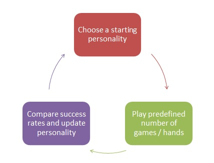

#Team "ColdCall"
##### Тодор Мицковски [[telerik]](http://telerikacademy.com/Users/todorm85) [[github]](https://github.com/todorm85)

##### Николай Петров [[telerik]](http://telerikacademy.com/Users/nlpcsh) [[github]](https://github.com/nlpcsh)

##### Явор Комитов [[telerik]](http://telerikacademy.com/Users/ykomitov) [[github]](https://github.com/ykomitov)

## DSA 2015 Teamwork
### Practical Teamwork Project - Texas Hold'em AI

* No limit heads up - 100 games, 1000 chips per player
* Time limit for each decision: 0.05 s

#### Approach towards creating the AI player

- **Calculating hand strength & other metrics**

The core of our selected approach was to**not use predefined tables** to evaluate playing potential but to **run simulations** instead for calculating each hand strength. Since the initial time limit per move was considerably higher (0.1 s) we started at 100 simulations / hand, but in the end due to lowered time limits we ended with 25 simulations / hand.

The OddsCalculator class is responsible for all computations we use in our AI player and can be found [here](https://github.com/ykomitov/TexasHoldem-ColdCall/blob/master/TexasHoldem/TexasHoldem.AI.TodorPlayer/Helpers/OddsCalculator.cs).

- **Create a pool of player personalities and rotate them based on game results**

Our idea was to create a pool of different player personalities - several aggressive, several "normal" and cautious players. Then, a **state pattern** was implemented which was responsible for selecting the best performing player based on each individual opponent.

- **Track game progress and dynamically select optimal player depending on game results**
 

1. All player personalities initialized with success rate of 1. Randomly chosen personality for starting state;
2. Play a predefined number of games (hands) then calculate & save this personality success rate;
3. After a number of games are finished loop through personalities and compare success rates to find the best one. Change the state to the best performing state. Go to step 2;

#### AI player personalities

**All-in protection**

Always check or call with hand strength > 0.6% and big blind above 10$

**Save all-in**

* If the other player raises, fold when money needed to call are >= half of otack & hand strength is below 0.8%;
* If hand strength is < .42% and player cannot check, then fold;
* If hand strength is > .95% raise big
* In any other case check or call

**Normal player**

To implement a normal player we use not only hand strength but also calculate pot odds and potential rate of return. The base strategy we implement is to mostly stay in hands with a rate of return greater than 1.

Pot odds = moneyToCall / (pot + moneyToCall);
Rate of return = handStrength / potOdds;

* If Rate of return < 0.8 then 95% fold, 0 % call, 5% raise (bluff)   
* If Rate of return < 1.0 then 80% fold, 5% call, 15% raise (bluff)
* If Rate of return <1.3 then 0% fold, 60% call, 40% raise
* Else (Rate of return >= 1.3) 0% fold, 30% call, 70% raise
* If fold and amount to call is zero, then call.

**Aggressive player**

Similar to the normal player, but bluffing more regularly
